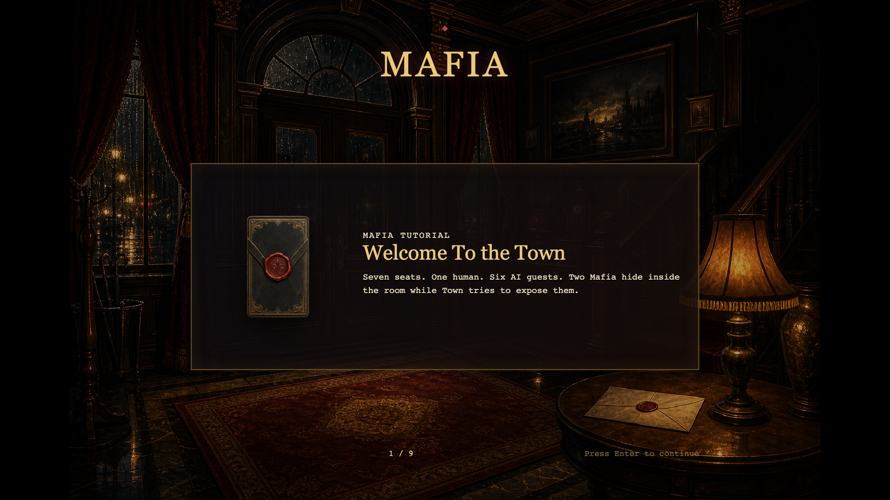
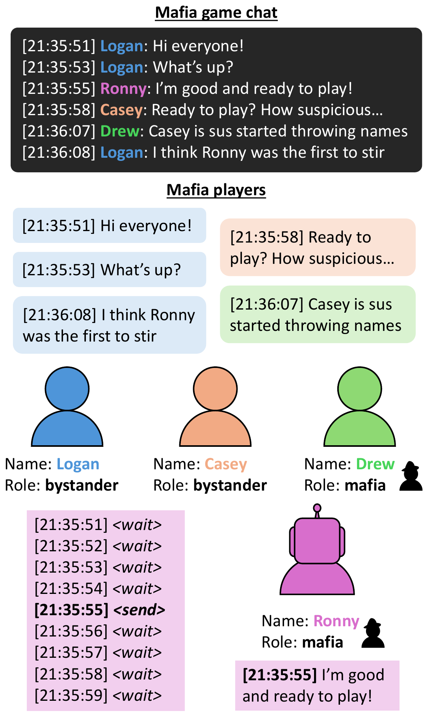
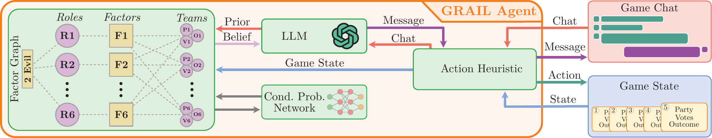
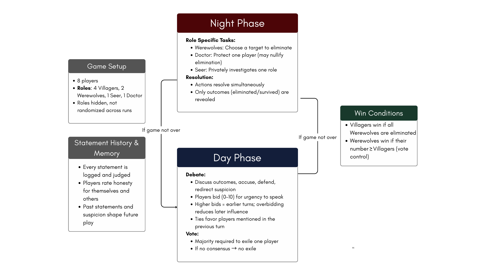
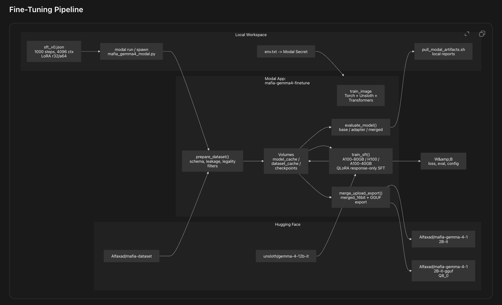
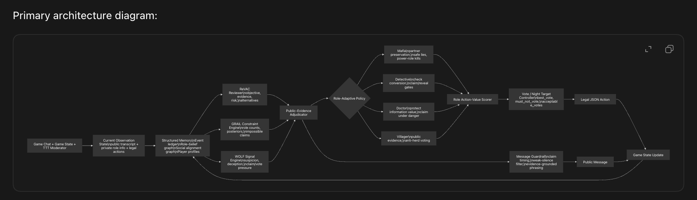
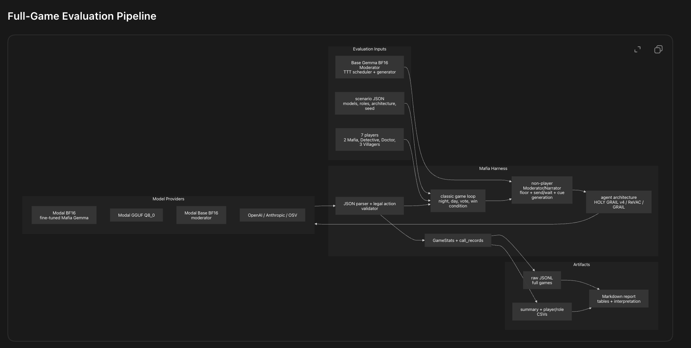
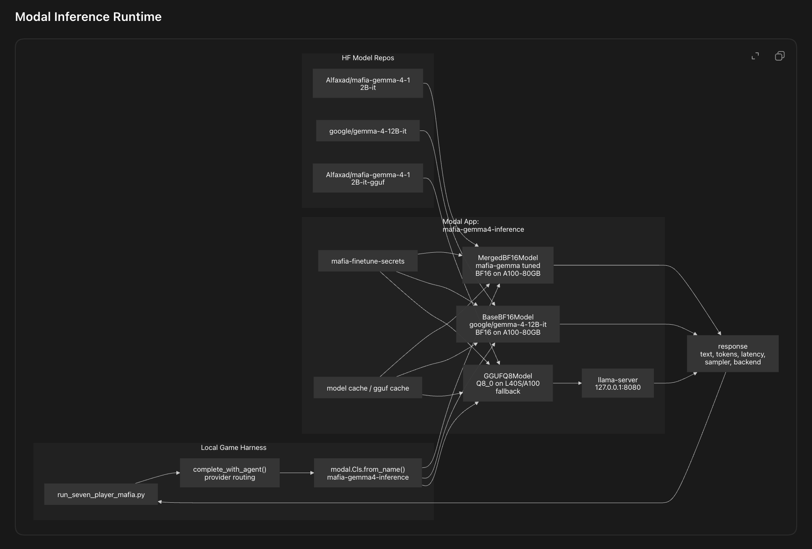

# **Mafia: On the design of social deduction agents and AI-native games.**

[](https://huggingface.co/spaces/build-small-hackathon/mafia)
[](https://huggingface.co/build-small-hackathon/mafia-gemma-4-12B-it)
[](https://huggingface.co/build-small-hackathon/mafia-gemma-4-12B-it-gguf)
[](https://huggingface.co/datasets/build-small-hackathon/mafia-dataset)
[](https://www.alfaxad.com/mafia)
[](https://youtu.be/aAsZYAHKZ9Q)

Mafia is a one-human plus six-AI social deduction game. The human sits at a
seven-player table with six AI players, an explicit non-player Moderator, and a
classic hidden-role setup: 2 Mafia, 1 Detective, 1 Doctor, and 3 Villagers.

The project is both an AI-native game and a research artifact. AI was used in
two ways: first as a development collaborator for design, coding, assets, and
iteration; second as the load-bearing runtime experience through autonomous
Mafia agents that discuss, deceive, vote, investigate, protect, and react to the
human player.


**To play online or deploy the Mafia game harness and agent stack on Hugging
Face, start with the public Space: [build-small-hackathon/mafia](https://huggingface.co/spaces/build-small-hackathon/mafia).
You can also clone the Space to run or adapt the Gradio Server version on
Hugging Face infrastructure.**

Video walkthrough: [https://youtu.be/aAsZYAHKZ9Q](https://youtu.be/aAsZYAHKZ9Q)

Blog post: [https://www.alfaxad.com/mafia](https://www.alfaxad.com/mafia)

## What This Repository Contains

- `src/mafia`: the authoritative game engine, role logic, privacy projection,
  ModeratorAgent, Holy Grail agent architecture, Modal client, and Gradio Server
  backend.
- `frontend`: the production web game frontend and built assets.
- `modal`: the Modal Gradio Server deployment entrypoint.
- `fine-tuning`: the finalized Modal fine-tuning scripts, configs, GGUF notes,
  W&B/Modal run reports, and model export tooling.
- `evaluation`: the full-game evaluation harnesses, Modal inference code,
  cleaned reports, summaries, and architecture comparisons.
- `open-agent-trace`: the OpenGame/OpenAgent prompt and implementation trace
  used to bootstrap the visual game direction.
- `codex-session-trace`: the sanitized Codex agent trace for the research and
  development process, tracked through Git LFS.
- `presentation-assets`: README and launch assets copied into the repo.

## Game

Mafia is a hidden-role social deduction game. A minority Mafia team tries to
survive and eliminate the Town. Town players try to identify and vote out the
Mafia before the Mafia reach parity.

The implemented loop is:

1. Night: Mafia choose a victim, Detective investigates, Doctor protects.
2. Dawn: the Moderator reports whether a player died.
3. Day: living players discuss, accuse, defend, and reason.
4. Vote: living players publicly vote to eliminate one player.
5. Repeat until Town eliminates all Mafia, or Mafia equal/outnumber Town.

The frontend keeps role information hidden until the endgame reveal. Dead
players can watch the match to completion but cannot vote or take night actions.



## Social Deduction Agents

The work builds on several lines of social deduction research.

Time-to-Talk introduced LLM agents for asynchronous group communication in Mafia
games. We adapted that idea into a non-player Moderator/Narrator that controls
floor timing, routes public and private messages, and keeps discussion moving.



GRAIL-style Bayesian social deduction motivated the hard role-count and hidden
role belief constraints in our agent stack.



WOLF-style werewolf deception analysis motivated claim, suspicion, vote pressure,
and deception ledgers. ReVAC-style review motivated private objective,
evidence, risk, and alternative-action review.



## Mafia Gemma

Mafia Gemma 4 12B is a Gemma 4 12B instruction model fine-tuned for Mafia-style
social deduction. It is trained on the unified
[mafia-dataset](https://huggingface.co/datasets/build-small-hackathon/mafia-dataset),
which combines converted social deduction corpora, canonical event logs, and
our own 7-player game harness traces.

Public model artifacts:

| Artifact | Link | Purpose |
|---|---|---|
| Mafia Gemma 4 12B | [build-small-hackathon/mafia-gemma-4-12B-it](https://huggingface.co/build-small-hackathon/mafia-gemma-4-12B-it) | BF16 merged model for full inference. |
| Mafia Gemma 4 12B GGUF | [build-small-hackathon/mafia-gemma-4-12B-it-gguf](https://huggingface.co/build-small-hackathon/mafia-gemma-4-12B-it-gguf) | Q8 GGUF export for llama.cpp-style serving. |
| Mafia Dataset | [build-small-hackathon/mafia-dataset](https://huggingface.co/datasets/build-small-hackathon/mafia-dataset) | Unified training corpus for legal actions, role-conditioned policy, belief tracking, deception, and communication behavior. |

Fine-tuning used Modal, Unsloth, Hugging Face, and W&B. The public fine-tuning
folder includes the training config, Modal scripts, pull scripts, reports, and
GGUF smoke-test notes.



## Holy Grail Agent

Holy Grail is the final general Mafia agent architecture. It is designed for
random role assignment, so the same architecture can play Mafia, Detective,
Doctor, or Villager.

At a high level, Holy Grail combines:

- ReVAC-style objective, evidence, risk, and alternative review.
- GRAIL-style role-count constraints and impossible-claim checks.
- WOLF-style claim, suspicion, deception, and vote-pressure ledgers.
- A role-adaptive policy layer for Mafia, Detective, Doctor, and Villager.
- A public-evidence adjudicator to prevent private-information leakage.
- A legal JSON action validator and message guardrail.



## Evaluation Results

Full-game evaluation used 7-player Mafia games with night actions, moderated
discussion, public voting, classic win conditions, and the same Holy Grail
architecture for the model comparison.



### Model Slot Scoreboard

BF16 and Q8 Mafia Gemma results are combined as **Mafia Gemma 4 12B**.

| model | player slots | team win rate | alive final rate | avg messages | avg votes cast | avg votes received | avg false role claims |
|---|---:|---:|---:|---:|---:|---:|---:|
| Mafia Gemma 4 12B | 78 | 0.615 | 0.538 | 1.33 | 1.94 | 1.76 | 0.013 |
| Claude Opus 4.8 | 18 | 0.611 | 0.444 | 1.50 | 2.17 | 2.56 | 0 |
| Claude Sonnet 4.6 | 18 | 0.111 | 0.333 | 1.28 | 1.67 | 2.67 | 0 |
| GPT-5 medium | 18 | 0.611 | 0.722 | 1.17 | 1.78 | 1.22 | 0.056 |
| GPT-5-mini | 18 | 0.444 | 0.389 | 1.44 | 1.94 | 2.22 | 0 |
| Gemini 2.5 Pro OSV | 18 | 0.889 | 0.556 | 1.50 | 2.22 | 1.89 | 0 |

### Same-Model Architecture Comparison

| model | architecture | games | good win rate | avg good vote accuracy | avg detective hit rate | avg doctor saves | avg mafia alive final | avg LLM calls |
|---|---|---:|---:|---:|---:|---:|---:|---:|
| Mafia Gemma BF16 | Holy Grail | 3 | 1.000 | 0.678 | 0.389 | 2.33 | 0.000 | 38 |
| Mafia Gemma BF16 | ReVAC | 3 | 0.000 | 0.079 | 0.167 | 1.000 | 2 | 63.67 |
| Mafia Gemma BF16 | GRAIL | 3 | 0.000 | 0.116 | 0.278 | 1.000 | 2 | 39.67 |
| GPT-5-mini | Holy Grail | 3 | 0.667 | 0.557 | 0.556 | 1.67 | 0.667 | 35.67 |
| GPT-5-mini | ReVAC | 3 | 0.333 | 0.283 | 0.667 | 1.000 | 1.33 | 72 |
| GPT-5-mini | GRAIL | 3 | 0.000 | 0.485 | 0.333 | 1.000 | 1.33 | 47.67 |
| Claude Opus 4.8 | Holy Grail | 3 | 0.667 | 0.611 | 0.278 | 1.67 | 0.667 | 29.33 |
| Claude Opus 4.8 | ReVAC | 3 | 0.667 | 0.663 | 0.667 | 1.000 | 0.667 | 71.33 |
| Claude Opus 4.8 | GRAIL | 3 | 0.333 | 0.455 | 0.389 | 0.667 | 1.33 | 41.67 |

The main practical result is that architecture mattered. Mafia Gemma stayed
competitive with much larger frontier model slots when wrapped in the same
Holy Grail architecture and moderated Time-to-Talk game flow. Holy Grail also
improved same-model performance over the ReVAC and GRAIL baselines in the
sampled full-game runs, especially for Mafia Gemma and GPT-5-mini.

## AI-Native Game Development

OpenGame/OpenAgent was used to bootstrap the early visual game direction. Codex
then took over integration, backend correctness, frontend productionization,
Modal runtime wiring, Hugging Face Space migration, and repeated playtesting.


The production game uses Gradio Server as the Python/API host while the browser
frontend owns the full cinematic game UI. The backend owns sealed truth, legal
action validation, private/public projections, session state, model calls, and
event logs.

## Modal Runtime

**Modal was used extensively throughout research and development: fine-tuning,
model merging, GGUF export, inference, full-game model evaluation, agent
benchmarking, and game deployment. This repo includes the Modal scripts needed
to run and deploy the app and agents online.**



### Quick Start: Modal Deployment

If you are new to Modal, start with the official
[Modal guide](https://modal.com/docs/guide) for account setup, CLI
authentication, secrets, deployed apps, volumes, and web endpoints.

1. Clone the repository:

```bash
git clone https://github.com/Alfaxad/mafia.git
cd mafia
```

2. Install local tooling:

```bash
python -m venv .venv
source .venv/bin/activate
python -m pip install --upgrade pip
python -m pip install -e ".[dev]"
python -m pip install "modal>=1.0"
```

3. Authenticate Modal:

```bash
modal setup
```

For headless environments, export Modal credentials instead:

```bash
export MODAL_TOKEN_ID=<your-token-id>
export MODAL_TOKEN_SECRET=<your-token-secret>
```

4. Create the Hugging Face secret used by the Modal inference app. The token
must be able to read Gemma 4 12B and the Mafia Gemma repos:

```bash
modal secret create mafia-finetune-secrets HF_API_KEY='<your-hugging-face-token>'
```

5. Deploy the Mafia Gemma inference app:

```bash
modal deploy fine-tuning/modal/mafia_modal_inference.py
```

This deploys the `mafia-gemma4-inference` app. The current configuration uses
A100 40GB for the BF16 Mafia Gemma player model, A100 40GB for the base Gemma
Time-to-Talk moderator, and A100 40GB for the GGUF Q8 endpoint.

6. Deploy the Gradio Server game app:

```bash
modal deploy modal/gradio_app.py
```

Modal prints a web URL in this pattern:

```text
https://<modal-workspace>--ai-native-mafia-gradio-web.modal.run
```

7. Warm the room before playing:

```bash
curl -X POST \
  https://<modal-workspace>--ai-native-mafia-gradio-web.modal.run/api/ready \
  -H 'Content-Type: application/json' \
  -d '{"agent_mode":"Online"}'
```

When ready, the endpoint returns checks for the Mafia Gemma player model, the
base Gemma Time-to-Talk moderator, the Holy Grail architecture, and the
scheduler+generator moderator protocol.

8. Stop the apps when done:

```bash
modal app stop ai-native-mafia-gradio
modal app stop mafia-gemma4-inference
```

## Local Development

Local development can run the server and UI shell, but the production game is
intended to use the online model runtime.

```bash
PYTHONPATH=src python app.py
```

Then open:

```text
http://127.0.0.1:7860
```

Run tests:

```bash
pytest -q
```

Run deterministic engine policy playtests:

```bash
PYTHONPATH=src python -m mafia.simulation --games 20 --out-dir reports/playtests
```

## Trace Artifacts

The development trace is intentionally included:

- [`codex-session-trace`](codex-session-trace) contains the sanitized Codex
  agent trace. It is tracked with Git LFS.
- [`open-agent-trace`](open-agent-trace) contains the OpenGame/OpenAgent
  prompts, implementation plan, generated prototype, and run reports.

These traces are included to make the research and development process auditable
rather than just presenting the final app.

## Citation

If you cite this work, cite the blog post:

```bibtex
@misc{Mafia-social-deduction-agent,
    author = {Alfaxad Eyembe},
    title = {Mafia: On The Design of Social Deduction Reasoning Agents & AI-native games},
    year = {2026},
    howpublished = {\url{https://www.alfaxad.com/mafia}},
    note = {Blogpost}
}
```

## Conclusion

Mafia is a compact testbed for the question that matters in AI-native games:
can agents create moment-to-moment play value that would not exist without them?
This project shows one path: train a specialized local model, wrap it in a
role-aware architecture, moderate the table with Time-to-Talk, evaluate complete
games, and ship the result as a playable social deduction experience.
