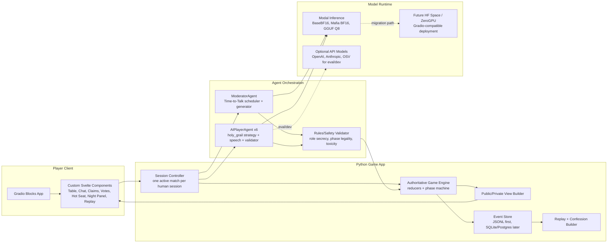
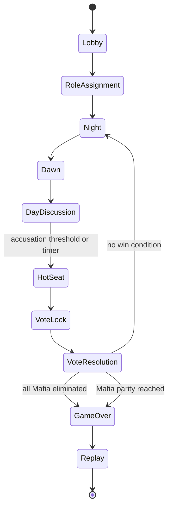
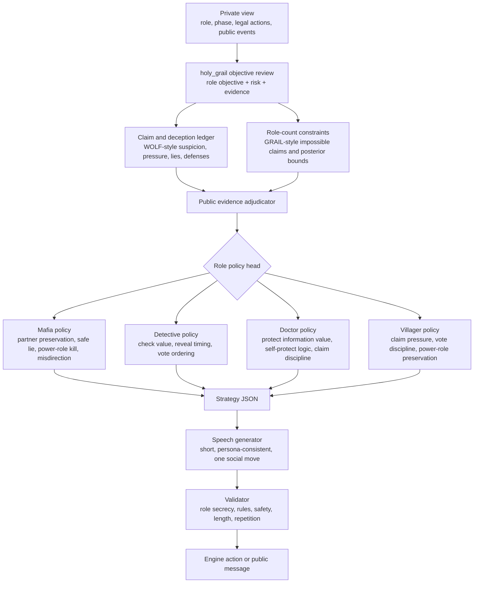
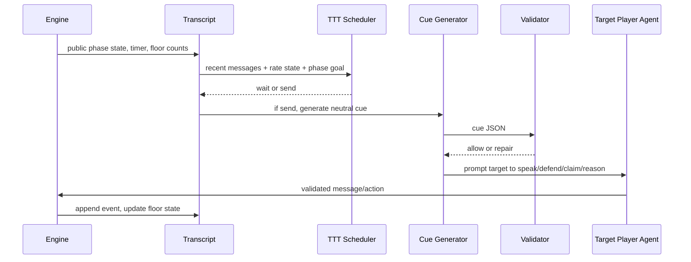

# AI-Native Mafia Development Plan

Date: 2026-06-14

## Product Thesis

Build a one-human, six-AI Mafia game where AI is load-bearing for the moment-to-moment experience, but not authoritative over rules. The models should carry the drama: social timing, accusations, pressure, defense, deception, confession, and personality. The deterministic engine should own the facts: roles, private views, legal actions, phase transitions, voting, eliminations, and win conditions.

Target match:

- Players: 1 human plus 6 AI.
- Roles: 2 Mafia, 1 Detective, 1 Doctor, 3 Villagers.
- Loop: Night -> Dawn -> Day discussion -> Hot-seat accusation/vote -> repeat.
- Moderator: explicit non-player Time-to-Talk Moderator/Narrator, using base Gemma 4 12B BF16 by default.
- AI players: Mafia Gemma plus the renamed `holy_grail` architecture, upgraded from `holy_grail_v4`.
- Staging infra: Modal for backend/model execution.
- Production target: Hugging Face Space with Gradio, ZeroGPU where viable.

The game should not feel like a benchmark UI. It should feel like a live social table: portraits, timing, visible claims, public votes, quick reactions, pressure states, and a post-game reveal that makes hidden reasoning entertaining instead of opaque.

## Experience Principles

The design target is not "a human chats with six bots." The target is "a human sits at a tense table with six believable players." That distinction should drive the implementation.

Principles:

- The human should always know the current phase, their legal actions, who is under pressure, and what evidence is public.
- The AI cast should create social texture through timing, disagreement, suspicion, and short reactive messages, not long explanations.
- The moderator should keep the floor alive without feeling like a strategy assistant.
- The UI should externalize the hard parts of social deduction: claims, votes, counterclaims, deaths, and accusation history.
- Hidden information must stay hidden during play, but become narratively satisfying after the game through replay and confession views.
- The human can be assigned any role, so every role needs a first-class interface: Mafia night kill/coordination, Detective inspect, Doctor protect, Villager discussion/vote.
- The game should preserve ambiguity while preventing confusion: uncertainty is fun; unclear controls are not.

The first delightful loop is:

1. The moderator opens a timed discussion.
2. AI players speak in short, targeted bursts.
3. A visible claim or vote conflict emerges.
4. The human acts through a clear command surface.
5. The table reacts.
6. A hot-seat vote resolves the pressure.
7. The endgame replay reveals what the AIs were trying to do.

## Reviewed Inputs

Local references:

- `ai-native/ai-native-mafia-deep-research-report.md`
- `ai-native/ui-1.png` through `ai-native/ui-5.png`
- `reports/paper_text/time-to-talk.txt`
- `LLMafia/llm_players/schedule_then_generate_player.py`
- `LLMafia/llm_players/generate_then_schedule_player.py`
- `LLMafia/llm_players/llm_constants.py`
- `LLMafia/llm_interface.py`
- `mini-mafia-game/mini-mafia-benchmark/experiments/run_seven_player_mafia.py`
- `reports/holy_grail_v4_architecture/holy_grail_v4_final_report.md`
- `assets/modal_apps_actual_pipeline_diagrams.md`
- `fine-tuning/modal/mafia_modal_inference.py`

External references:

- Time-to-Talk project: https://niveck.github.io/Time-to-Talk/
- Gradio custom components: https://gradio.app/guides/custom-components-in-five-minutes
- Gradio on Modal: https://gradio.app/guides/deploying-gradio-with-modal
- Hugging Face ZeroGPU: https://huggingface.co/docs/hub/en/spaces-zerogpu
- Open Mafia Engine: https://github.com/open-mafia/open_mafia_engine
- boardgame.io: https://boardgame.io/

## Key Design Decisions

### 1. Use An Authoritative Event-Sourced Engine

The current benchmark harness has the right game loop, but it is evaluation-oriented. The game repo should extract the logic into a clean product engine:

- Pure reducers for night actions, dawn resolution, discussion windows, vote locking, elimination, and win checks.
- Event-sourced logs for replay, audit, dataset export, and post-game confession.
- Private/public view generation, so models and humans only see legal information.
- No model can directly mutate hidden truth or game state.

This mirrors the useful pattern from Open Mafia Engine and boardgame.io: a game is easier to test and reason about when state transitions are explicit and moves are reducers.

### 2. Keep Time-to-Talk As A Real Non-Player Moderator Agent

Time-to-Talk is not just a chat setting. In this game it should be an explicit Moderator/Narrator agent that controls discussion rhythm:

- Scheduler decides `send` vs `wait` based on floor state, timing, recent messages, and phase objective.
- Generator produces a short neutral cue when the scheduler sends.
- Candidate-first mode remains available for quality filtering.
- Typing delay and inter-message gap simulation remain first-class UX mechanics.
- Moderator never reveals hidden information and never takes a player action.

The current `moderated_quality_time_to_talk` implementation is the right prototype, but product code should expose this as `ModeratorAgent`.

### 3. Rename `holy_grail_v4` To `holy_grail`

The public architecture should be `holy_grail`. Internally we can preserve `holy_grail_v4` as a migration alias for old reports and harness compatibility.

Recommended long form:

**HOLY GRAIL: Hidden-role Objective Ledgering with Yield-aware Graph Reasoning Agent Informed through Language**

Operationally, `holy_grail` is:

- ReVAC-style private objective/evidence/risk review.
- WOLF-style suspicion, claim, deception, partner-pressure, and vote ledger.
- GRAIL-style role-count and impossible-claim constraints.
- Role-specific policy heads for Mafia, Detective, Doctor, and Villager.
- Public-evidence adjudication and vote-closing guardrails.
- Speech guardrails for concise, role-safe, non-repetitive messages.

### 4. Start With Mafia Gemma BF16 For Quality, Keep GGUF As A Runtime Option

For live product staging, use:

- `BaseBF16Model` as default moderator.
- `MergedBF16Model` as default AI player model.
- `GGUFQ8Model` as an optional latency/cost path after live reliability gates.

The BF16 path should be the reference implementation because the game depends on coherence, JSON validity, and human-like social nuance. GGUF can become a production option if it passes the same gates: action legality, no role leakage, low parse failures, acceptable latency, and comparable player experience.

## System Architecture



## Match Flow



Night is mostly action UI. Day is the social core. Hot Seat is a distinct dramatic phase where the accused becomes the visual focus, gets a short defense window, and the vote board becomes the primary control.

## UI Plan

The five provided mockups map cleanly to product screens:

| UI reference | Product meaning | Main components |
|---|---|---|
| `ui-1.png` | Default desktop live game | `MafiaTable`, `ClaimLedger`, `VoteBoard`, `ChatLog`, `ActionBar`, `ReplayTicker` |
| `ui-2.png` | First-time onboarding and role guidance | `CoachOverlay`, `RoleCard`, `SuggestedActionPanel` |
| `ui-3.png` | Rich social state | `PortraitStatusBadge`, `TypingIndicator`, `TrustCard`, `QuickReactionBar` |
| `ui-4.png` | Accusation and vote drama | `HotSeatVoteView`, `EvidenceCards`, `VoteArrows`, `FinalStatementPanel` |
| `ui-5.png` | Endgame and delight loop | `EndgameReveal`, `ReplayTimeline`, `ConfessionBooth`, `AwardsPanel` |

### Gradio Custom Components

Use Gradio Blocks for the app shell, but build custom components for the game surfaces. Default Gradio chat components are not enough for this UI.

Initial component package:

- `MafiaTable`: circular seven-seat table, portraits, alive/dead state, role-hidden status, active speaker, typing state.
- `ChatLog`: public day transcript with short messages, speech-act tags, moderator cues, filters.
- `ClaimLedger`: claimed role, confidence, counterclaims, key quote, night-action story, last vote.
- `VoteBoard`: current votes, lock state, threshold, vote history.
- `ActionBar`: phase-aware human actions: ask, accuse, defend, claim, vote, skip, night action.
- `NightActionPanel`: Detective inspect, Doctor protect, Mafia kill if human is Mafia.
- `HotSeatVoteView`: accused focus, defense timer, evidence cards, vote arrows, lock confirmation.
- `ReplayTimeline`: event scrubber, role reveal, model confession snapshots.
- `CoachOverlay`: contextual tutorial and suggestions without dumping a rulebook.

The custom component workflow should follow Gradio's create/dev/build/publish flow. Gradio custom components are packaged with Python backend and Svelte frontend, and can still work with Blocks, themes, and API usage.

## Product State Contracts

### `GameState`

Core fields:

- `game_id`
- `seed`
- `phase`
- `day_number`
- `players`
- `alive`
- `roles`
- `mafia_team`
- `votes`
- `claims`
- `night_actions`
- `timers`
- `winner`
- `events`

### `PlayerState`

Core fields:

- `player_id`
- `display_name`
- `seat`
- `is_human`
- `role`
- `alignment`
- `alive`
- `persona`
- `model_spec`
- `architecture`
- `private_memory`
- `public_status`

### `Event`

Every meaningful thing becomes an event:

- `phase_started`
- `moderator_cue`
- `player_message`
- `claim_updated`
- `vote_cast`
- `vote_locked`
- `night_action_submitted`
- `dawn_announced`
- `player_eliminated`
- `role_revealed`
- `validator_repair`
- `model_call`
- `game_over`

Event logging is not optional. It powers replay, debugging, fine-tuning data, analytics, and safety review.

### `AgentRequest`

The model should receive a bounded private view, not raw state:

- `agent_id`
- `role`
- `phase`
- `public_transcript_window`
- `public_claims`
- `vote_board`
- `alive_players`
- `private_info`
- `legal_actions`
- `persona_style`
- `timing_context`

### `AgentResponse`

Use structured JSON at the strategy layer:

- `action`
- `target`
- `message`
- `speech_act`
- `emotion`
- `confidence`
- `private_rationale_summary`
- `validator_status`

The UI only displays `message`, `speech_act`, `emotion`, and legal public action effects.

## Agent Architecture In Product Form



## Moderator Architecture



The moderator should feel like a host, not an analyst. It should ask short, neutral, game-advancing prompts:

- "Casey, give one concrete reason for that vote."
- "Ariel, respond to the counterclaim."
- "Table, one more claim before votes lock."
- "Gray, are you accusing or just pressuring?"

## Repo Layout

Recommended structure for `/Users/alfaxad/Desktop/AI/Games/mafia`:

```text
mafia/
  README.md
  pyproject.toml
  app.py
  src/mafia/
    engine/
      state.py
      events.py
      reducers.py
      phases.py
      roles.py
      views.py
      replay.py
    agents/
      base.py
      holy_grail.py
      moderator_ttt.py
      validators.py
      prompts/
        holy_grail_strategy.md
        holy_grail_speech.md
        moderator_scheduler.md
        moderator_generator.md
    models/
      modal_client.py
      local_stub.py
      provider_types.py
    ui/
      app.py
      session.py
      adapters.py
      theme.py
    logging/
      event_store.py
      metrics.py
      export_dataset.py
  components/
    mafia_table/
    claim_ledger/
    vote_board/
    hot_seat_vote/
    replay_timeline/
  modal/
    gradio_app.py
    inference_client.py
  tests/
    test_engine_phases.py
    test_role_legality.py
    test_private_views.py
    test_win_conditions.py
    test_agent_validators.py
    test_replay.py
  docs/
    ai-native-mafia-development-plan.md
```

## Development Milestones

### Milestone 0: Product Skeleton

Deliverables:

- Python package skeleton.
- Gradio app shell.
- Local stub model provider.
- `holy_grail_v4` compatibility alias renamed to `holy_grail`.
- Shared type contracts for state, events, views, and agent responses.

Exit criteria:

- `pytest` runs.
- A local deterministic stub game can complete without model calls.

### Milestone 1: Authoritative Game Engine

Deliverables:

- Seven-player setup with one human and six AI.
- Deterministic role assignment and private view generation.
- Night actions for Mafia, Detective, Doctor.
- Dawn kill/protection/investigation resolution.
- Day discussion state.
- Hot-seat accusation and vote lock.
- Classic win conditions.
- Full event log and replay reducer.

Exit criteria:

- Golden test games pass.
- Hidden role leakage tests pass.
- Engine can replay from event log to identical final state.

### Milestone 2: Agent Orchestrator

Deliverables:

- `ModeratorAgent` using Time-to-Talk scheduler plus generator.
- `HolyGrailAgent` with strategy, speech, and validator stages.
- Modal client wrapper for base Gemma BF16 and Mafia Gemma BF16.
- Runtime provider flags for BF16 vs GGUF.
- Structured repair loop for invalid model JSON.

Exit criteria:

- Six AI players can complete a full game with one stub human.
- Parse failure rate is measured and below threshold.
- Role secrecy validator blocks simulated leaks.

### Milestone 3: First Interactive Gradio UI

Deliverables:

- Desktop layout matching `ui-1.png` as the first target.
- Live table, chat, claim ledger, vote board, and action bar.
- Human night action UI.
- Human vote and accusation UI.
- Streaming or polling updates for AI/moderator actions.

Exit criteria:

- A human can play a full local game end to end.
- No hidden information appears in the wrong view.
- UI remains usable at desktop and mobile widths.

### Milestone 4: Custom Components And Visual Polish

Deliverables:

- Svelte custom components for table, ledger, vote board, hot seat, replay.
- Portrait status badges and typing indicators.
- Coach overlay for first-time players.
- Dedicated hot-seat vote view from `ui-4.png`.
- Endgame reveal/replay view from `ui-5.png`.

Exit criteria:

- Component demos build with `gradio cc build`.
- Main app uses packaged components, not ad hoc HTML blobs.
- Screenshot checks cover desktop and mobile.

### Milestone 5: Modal Staging Deployment

Deliverables:

- Modal ASGI Gradio app using `mount_gradio_app`.
- CPU Gradio/session container calling separate GPU inference classes.
- Session isolation and event persistence.
- One staging URL for playtests.

Implementation note: Gradio's Modal guide recommends wrapping the Gradio app in a Modal ASGI function. Because Gradio needs sticky sessions, keep the UI function at `max_containers=1` initially and call GPU inference through separate Modal classes/functions.

Exit criteria:

- A full human-vs-AI game runs on Modal staging.
- Model calls are logged with latency, tokens, sampler, provider, and validation status.
- Modal apps scale down cleanly when idle.

### Milestone 6: Playtest Analytics And Iteration

Deliverables:

- Match metrics dashboard from event logs.
- Human feedback prompts after games.
- AI believability and delight metrics.
- Replay review workflow.

Core metrics:

- Completion rate.
- Average match duration.
- Time spent per phase.
- Moderator send/wait ratio.
- AI message words per message.
- Human response latency.
- Vote accuracy by role.
- Claim/counterclaim counts.
- Validator repairs.
- Parse failures.
- Role leakage incidents.
- Player-rated immersion.
- Player-rated fairness.
- Rematch intent.

Exit criteria:

- At least 20 internal playtest games.
- No critical leakage or engine-authority bugs.
- Clear BF16 vs GGUF reliability decision from live data.

### Milestone 7: Hugging Face Space Migration

Deliverables:

- HF Space version of the Gradio app.
- ZeroGPU experiment for model execution where viable.
- Fallback route to Modal inference if ZeroGPU cold starts or queues damage UX.
- Private model access configured for `Alfaxad/mafia-gemma-4-12B-it`.

ZeroGPU constraints to respect:

- It is Gradio-SDK-only.
- GPU work should be wrapped in `@spaces.GPU`.
- Queueing and dynamic allocation must be treated as UX risks.
- BF16 model loading/caching must be measured before committing to full production.

Exit criteria:

- HF Space can run at least one full game reliably.
- Cold-start and per-turn latency are acceptable or hidden by moderator pacing.

## Testing Strategy

### Engine Tests

- Role assignment count invariants.
- Mafia parity win condition.
- Town all-Mafia-eliminated win condition.
- Doctor save prevents Mafia kill.
- Detective gets alignment-only result.
- Dead players cannot vote or act.
- Tie policy is deterministic.
- Replay produces identical state.

### Agent Tests

- Strategy JSON schema validation.
- Illegal action repair.
- Role secrecy prompts and adversarial hidden-info leakage attempts.
- Speech length cap.
- Repetition cap.
- Vote target legality.
- Moderator neutrality.
- Moderator cue quality.

### UI Tests

- Desktop screenshot for normal day.
- Mobile screenshot for normal day.
- Night action panel visibility by role.
- Hot-seat flow.
- Vote lock confirmation.
- Endgame reveal.
- No overlap in action bar and ledger.
- Accessibility: focus states, keyboard path, touch targets.

### Integration Tests

- Full stub game.
- Full Modal BF16 game.
- Full GGUF game.
- Restart/replay from stored event log.
- Recovery from one failed model call.
- Recovery from invalid JSON.

## Initial Technical Choices

| Area | Choice | Reason |
|---|---|---|
| App framework | Gradio Blocks plus custom Svelte components | Fast ML-app iteration, HF Space path, custom visual surfaces |
| Staging | Modal ASGI Gradio app + separate GPU model classes | Reuses current successful Modal inference stack |
| Production target | HF Space, with ZeroGPU trial | Aligns with user goal and Gradio compatibility |
| Engine | Python event-sourced state machine | Easier integration with model code and existing harness |
| AI player model | Mafia Gemma BF16 first | Highest reliability reference for live social behavior |
| Moderator model | Base Gemma 4 12B BF16 | Previously best moderator discovery |
| Quantized option | GGUF Q8 as opt-in runtime | Cost/latency candidate after reliability gate |
| Public architecture name | `holy_grail` | Product-ready name; v4 remains compatibility alias |

## Risks And Mitigations

| Risk | Mitigation |
|---|---|
| AI leaks hidden role/state | Private view builder, validator, repair loop, red-team tests |
| AI talks too much | TTT scheduler, floor constraints, per-agent budgets, word caps |
| Game feels like chat, not game | Table UI, action chips, claim ledger, hot seat, vote board |
| Human gets overwhelmed | Coach overlay, role card, suggested actions, structured claims |
| Latency breaks immersion | Typing simulation, staggered AI turns, model call batching where safe |
| GGUF quality regression | Keep BF16 reference; promote GGUF only after playtest gates |
| HF ZeroGPU queues harm UX | Keep Modal fallback; use ZeroGPU only after latency tests |
| Benchmark code becomes product code | Extract contracts and policies; build clean engine in `mafia` |

## First Implementation Sprint

Recommended first sprint scope:

1. Create `pyproject.toml`, package skeleton, and tests.
2. Implement `GameState`, `PlayerState`, `Event`, role constants, and reducers.
3. Port the seven-player classic loop from the harness into tested engine code.
4. Implement private/public view builders.
5. Add a local stub AI provider that plays deterministic legal actions.
6. Build a minimal Gradio app with table placeholders, chat, vote board, and action buttons.
7. Run one local full game with the human using stub AIs.

Do not start with portraits or Modal deployment. The first gate is a playable, replayable, leakage-safe game loop. Once that is stable, connect Modal models and then replace placeholder UI surfaces with custom components.

## Definition Of A Good MVP

The MVP is good enough when:

- A human can play a complete seven-player game without manual intervention.
- The six AI players speak sparsely, accuse, defend, claim, vote, and react coherently.
- The moderator controls floor timing and keeps discussion moving.
- The player always understands the current phase, available actions, votes, and claims.
- Hidden information never leaks through UI or prompts.
- Endgame replay explains what happened in a satisfying way.
- Event logs are complete enough to reproduce, debug, and later finetune from the match.
