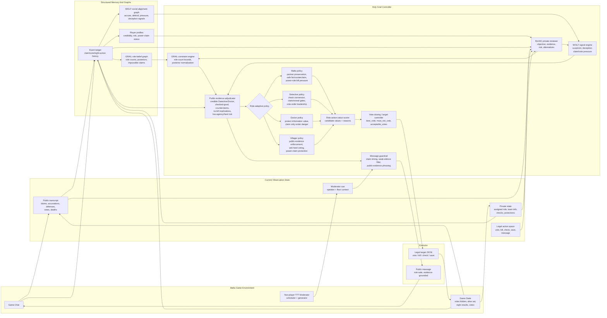
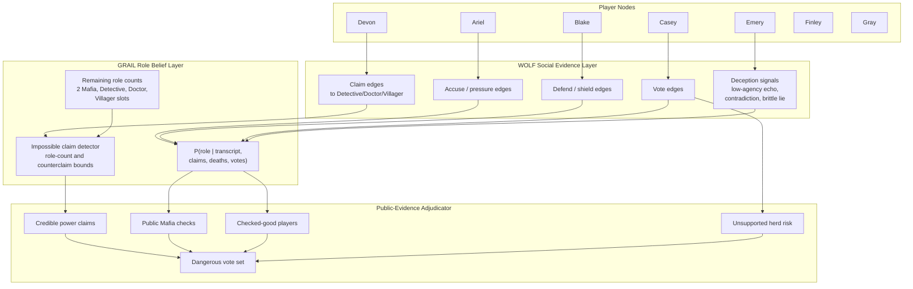
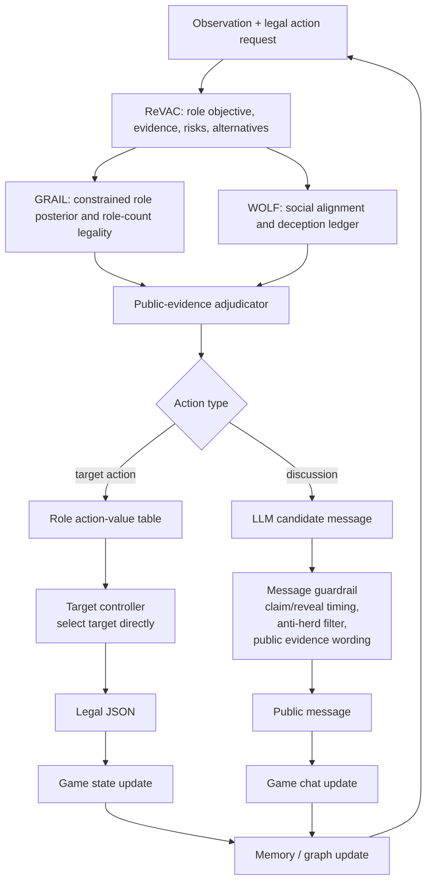

# Holy Grail Architecture Name And Diagrams

## Proposed Name

**Holy Grail**: **Hierarchical Objective-guided Ledgered Yield-aware Graph Reasoning Agent Informed through Language**.

Short interpretation:

- **H**ierarchical: ReVAC review, GRAIL constraints, WOLF social evidence, public-evidence adjudication, role policy, and executor are ordered layers.
- **O**bjective-guided: starts every decision from the current role objective, win condition, private information, and risk.
- **L**edgered: maintains structured ledgers for claims, votes, investigations, protections, suspicion, deception, and public evidence.
- **Y**ield-aware: decides when to speak, claim, defend, wait, or close a vote under the Time-to-Talk floor and game tempo.
- **GRAIL**: Graph Reasoning Agent Informed through Language, using language observations to update role-belief and social-evidence graphs.

## System Architecture

## Graph / Ledger View

## Decision Flow

## Code-Level Mapping

| architecture concept | implementation location |
|---|---|
| Holy Grail name and role kernel | `architecture_text`, `holy_grail_role_kernel` |
| public investigation / checked-good extraction | `holy_grail_public_investigation_claims` |
| power-claim and public-evidence adjudication | `holy_grail_claim_adjudication` |
| low-agency / herd / leadership signals | `holy_grail_discussion_quality_signals` |
| role action-value table | `holy_grail_action_values` |
| vote-closing plan | `holy_grail_vote_plan` |
| prompt-visible controller state | `format_holy_grail_state_context` |
| message guardrail | `holy_grail_message_guardrail` |
| direct target controller | `holy_grail_recommended_target`, `apply_holy_grail_target_guardrail` |
