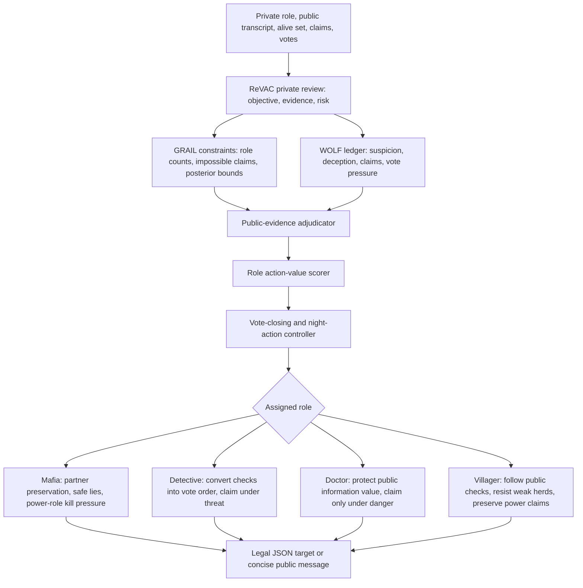
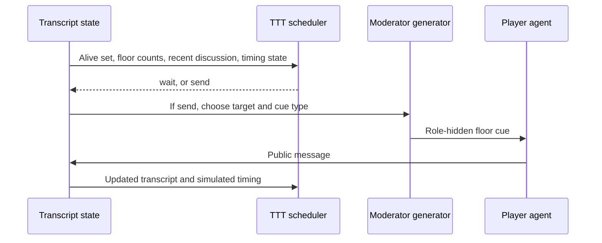

# Holy Grail Same-Model Full-Game Benchmark

Generated from 27 completed full games. Expected rows for the configured matrix: 27.

Controls:
- Roles: 2 Mafia, 1 Detective, 1 Doctor, 3 Villagers.
- Win conditions: classic Mafia parity for Mafia; all Mafia eliminated for Town.
- Protocol: explicit non-player Moderator/Narrator agent using Time-to-Talk scheduler plus generator.
- Moderator: base Gemma 4 12B BF16 through Modal.
- Gemma sampler: `temperature=1.0`, `top_p=0.95`, `top_k=64` for both base moderator and Mafia Gemma BF16 players.
- Same-model architecture tests: all seven player agents in a cell used the same player model and same architecture.
- Seeds: 9900, 9901, 9902 per architecture cell.
- Validation: total API/player/moderator errors across aggregated rows = 0.

## Architecture

Long form: **Hidden-role Objective Ledgering with Yield-aware Game-theoretic Role-Adaptive Inference Loop**.

Important implementation note: Holy Grail directly controls target decisions for vote, Mafia kill, Detective check, and Doctor save. Discussion remains model-generated, with Holy Grail message guardrails only when public evidence or role-risk gates are triggered. This makes Holy Grail a stronger architecture test, not a pure raw-model target-generation test.

## Moderator Protocol

## Iteration Audit

- Holy Grail started from v3 but added a public-evidence adjudicator for role claims, public Detective checks, checked-good claims, low-agency evasion, and unsupported herd votes.
- The live Mafia Gemma gate exposed a latency and reliability issue: Holy Grail was still spending target actions on redundant ReVAC/model calls.
- The controller was revised so Holy Grail computes all target decisions through the architecture policy. This removed the repeated ReVAC review bottleneck and made the architecture legible in the logs through `architecture_guardrail` events.
- The gate criterion before broader runs was Mafia Gemma BF16 Holy Grail beating Mafia Gemma BF16 ReVAC and GRAIL on the same three seeds.
- Gate result: Mafia Gemma BF16 Holy Grail reached 3/3 Good wins with Good vote accuracy 0.678.

## Outcome Table

| Model | Architecture | n | Good wins | Mafia wins | Good WR | Days | Good vote | Mafia vote | Detective hit | Doctor saves | Mafia alive | Target overrides | Msg overrides |
| --- | --- | --- | --- | --- | --- | --- | --- | --- | --- | --- | --- | --- | --- |
| Mafia Gemma BF16 | Holy Grail | 3 | 3 | 0 | 1.000 | 3.000 | 0.678 | 1.000 | 0.389 | 2.333 | 0.000 | 26.333 | 1.667 |
| Mafia Gemma BF16 | ReVAC | 3 | 0 | 3 | 0.000 | 2.333 | 0.079 | 1.000 | 0.167 | 1.000 | 2.000 | 0.000 | 0.000 |
| Mafia Gemma BF16 | GRAIL | 3 | 0 | 3 | 0.000 | 2.333 | 0.116 | 1.000 | 0.278 | 1.000 | 2.000 | 0.000 | 0.000 |
| GPT-5-mini | Holy Grail | 3 | 2 | 1 | 0.667 | 3.000 | 0.557 | 1.000 | 0.556 | 1.667 | 0.667 | 25.000 | 4.333 |
| GPT-5-mini | ReVAC | 3 | 1 | 2 | 0.333 | 2.333 | 0.283 | 1.000 | 0.667 | 1.000 | 1.333 | 0.000 | 0.000 |
| GPT-5-mini | GRAIL | 3 | 0 | 3 | 0.000 | 3.000 | 0.485 | 1.000 | 0.333 | 1.000 | 1.333 | 0.000 | 0.000 |
| Claude Opus 4.8 | Holy Grail | 3 | 2 | 1 | 0.667 | 2.667 | 0.611 | 1.000 | 0.278 | 1.667 | 0.667 | 22.667 | 2.000 |
| Claude Opus 4.8 | ReVAC | 3 | 2 | 1 | 0.667 | 2.333 | 0.663 | 1.000 | 0.667 | 1.000 | 0.667 | 0.000 | 0.000 |
| Claude Opus 4.8 | GRAIL | 3 | 1 | 2 | 0.333 | 2.333 | 0.455 | 0.917 | 0.389 | 0.667 | 1.333 | 0.000 | 0.000 |

## Holy Grail Delta

| Model | Comparison | Good WR delta | Good vote delta | Detective hit delta | Mafia alive delta | LLM calls delta | Elapsed delta |
| --- | --- | --- | --- | --- | --- | --- | --- |
| Mafia Gemma BF16 | Holy Grail - ReVAC | 1.000 | 0.599 | 0.222 | -2.000 | -25.667 | -222.139 |
| Mafia Gemma BF16 | Holy Grail - GRAIL | 1.000 | 0.562 | 0.111 | -2.000 | -1.667 | 121.118 |
| GPT-5-mini | Holy Grail - ReVAC | 0.333 | 0.274 | -0.111 | -0.667 | -36.333 | -115.014 |
| GPT-5-mini | Holy Grail - GRAIL | 0.667 | 0.072 | 0.222 | -0.667 | -12.000 | -26.202 |
| Claude Opus 4.8 | Holy Grail - ReVAC | 0.000 | -0.052 | -0.389 | 0.000 | -42.000 | -171.120 |
| Claude Opus 4.8 | Holy Grail - GRAIL | 0.333 | 0.156 | -0.111 | -0.667 | -12.333 | -21.741 |

## Per-Game Results

| Model | Architecture | Seed | Winner | Days | Good vote | Detective hit | Doctor saves | Mafia alive | Target overrides | Msg overrides | LLM calls |
| --- | --- | --- | --- | --- | --- | --- | --- | --- | --- | --- | --- |
| Mafia Gemma BF16 | Holy Grail | 9900 | good | 2 | 0.800 | 0.500 | 2 | 0 | 20 | 0 | 32 |
| Mafia Gemma BF16 | Holy Grail | 9901 | good | 4 | 0.533 | 0.000 | 4 | 0 | 35 | 2 | 49 |
| Mafia Gemma BF16 | Holy Grail | 9902 | good | 3 | 0.700 | 0.667 | 1 | 0 | 24 | 3 | 33 |
| Mafia Gemma BF16 | ReVAC | 9900 | mafia | 2 | 0.125 | 0.500 | 1 | 2 | 0 | 0 | 70 |
| Mafia Gemma BF16 | ReVAC | 9901 | mafia | 3 | 0.111 | 0.000 | 2 | 2 | 0 | 0 | 78 |
| Mafia Gemma BF16 | ReVAC | 9902 | mafia | 2 | 0.000 | 0.000 | 0 | 2 | 0 | 0 | 43 |
| Mafia Gemma BF16 | GRAIL | 9900 | mafia | 3 | 0.222 | 0.333 | 2 | 2 | 0 | 0 | 51 |
| Mafia Gemma BF16 | GRAIL | 9901 | mafia | 2 | 0.125 | 0.500 | 1 | 2 | 0 | 0 | 42 |
| Mafia Gemma BF16 | GRAIL | 9902 | mafia | 2 | 0.000 | 0.000 | 0 | 2 | 0 | 0 | 26 |
| GPT-5-mini | Holy Grail | 9900 | mafia | 3 | 0.444 | 0.333 | 2 | 2 | 24 | 5 | 29 |
| GPT-5-mini | Holy Grail | 9901 | good | 3 | 0.727 | 0.667 | 2 | 0 | 27 | 5 | 42 |
| GPT-5-mini | Holy Grail | 9902 | good | 3 | 0.500 | 0.667 | 1 | 0 | 24 | 3 | 36 |
| GPT-5-mini | ReVAC | 9900 | mafia | 2 | 0.000 | 1.000 | 1 | 2 | 0 | 0 | 66 |
| GPT-5-mini | ReVAC | 9901 | mafia | 2 | 0.250 | 1.000 | 0 | 2 | 0 | 0 | 43 |
| GPT-5-mini | ReVAC | 9902 | good | 3 | 0.600 | 0.000 | 2 | 0 | 0 | 0 | 107 |
| GPT-5-mini | GRAIL | 9900 | mafia | 4 | 0.455 | 0.500 | 2 | 1 | 0 | 0 | 64 |
| GPT-5-mini | GRAIL | 9901 | mafia | 3 | 0.500 | 0.000 | 1 | 1 | 0 | 0 | 53 |
| GPT-5-mini | GRAIL | 9902 | mafia | 2 | 0.500 | 0.500 | 0 | 2 | 0 | 0 | 26 |
| Claude Opus 4.8 | Holy Grail | 9900 | good | 2 | 0.800 | 0.500 | 2 | 0 | 20 | 3 | 26 |
| Claude Opus 4.8 | Holy Grail | 9901 | good | 3 | 0.700 | 0.000 | 1 | 0 | 24 | 1 | 36 |
| Claude Opus 4.8 | Holy Grail | 9902 | mafia | 3 | 0.333 | 0.333 | 2 | 2 | 24 | 2 | 26 |
| Claude Opus 4.8 | ReVAC | 9900 | good | 2 | 0.889 | 1.000 | 1 | 0 | 0 | 0 | 68 |
| Claude Opus 4.8 | ReVAC | 9901 | mafia | 2 | 0.500 | 1.000 | 0 | 2 | 0 | 0 | 43 |
| Claude Opus 4.8 | ReVAC | 9902 | good | 3 | 0.600 | 0.000 | 2 | 0 | 0 | 0 | 103 |
| Claude Opus 4.8 | GRAIL | 9900 | good | 3 | 0.615 | 0.667 | 2 | 0 | 0 | 0 | 65 |
| Claude Opus 4.8 | GRAIL | 9901 | mafia | 2 | 0.750 | 0.000 | 0 | 2 | 0 | 0 | 27 |
| Claude Opus 4.8 | GRAIL | 9902 | mafia | 2 | 0.000 | 0.500 | 0 | 2 | 0 | 0 | 33 |

## Moderator And Flow Metrics

| Model | Architecture | LLM calls | ReVAC reviews | Mod sched | Mod gen | Send | Wait | Gap sec | Rate dev | Cue quality | Elapsed sec |
| --- | --- | --- | --- | --- | --- | --- | --- | --- | --- | --- | --- |
| Mafia Gemma BF16 | Holy Grail | 38.000 | 0.000 | 14.667 | 11.667 | 11.667 | 3.000 | 15.722 | 0.079 | 4.233 | 232.124 |
| Mafia Gemma BF16 | ReVAC | 63.667 | 24.667 | 8.000 | 6.333 | 6.333 | 1.667 | 15.389 | 0.127 | 3.571 | 454.263 |
| Mafia Gemma BF16 | GRAIL | 39.667 | 0.000 | 8.000 | 6.333 | 6.333 | 1.667 | 15.278 | 0.127 | 4.143 | 111.006 |
| GPT-5-mini | Holy Grail | 35.667 | 0.000 | 13.667 | 11.000 | 11.000 | 2.667 | 13.500 | 0.079 | 4.586 | 170.552 |
| GPT-5-mini | ReVAC | 72.000 | 26.667 | 10.333 | 8.333 | 8.333 | 2.000 | 15.222 | 0.118 | 4.190 | 285.565 |
| GPT-5-mini | GRAIL | 47.667 | 0.000 | 10.333 | 8.000 | 8.000 | 2.333 | 14.833 | 0.153 | 4.374 | 196.754 |
| Claude Opus 4.8 | Holy Grail | 29.333 | 0.000 | 11.333 | 9.000 | 9.000 | 2.333 | 15.000 | 0.111 | 4.462 | 142.191 |
| Claude Opus 4.8 | ReVAC | 71.333 | 26.667 | 10.000 | 8.000 | 8.000 | 2.000 | 16.000 | 0.090 | 3.645 | 313.311 |
| Claude Opus 4.8 | GRAIL | 41.667 | 0.000 | 9.000 | 7.333 | 7.333 | 1.667 | 15.889 | 0.079 | 3.722 | 163.932 |

## Role-Level Survival And Activity

| Model | Architecture | Role | n | Alive final | Messages | Votes cast | Votes received | Role claims | False claims |
| --- | --- | --- | --- | --- | --- | --- | --- | --- | --- |
| Mafia Gemma BF16 | Holy Grail | Detective | 3 | 0.333 | 1.333 | 2.000 | 3.333 | 1.333 | 0.000 |
| Mafia Gemma BF16 | Holy Grail | Doctor | 3 | 0.667 | 2.333 | 2.333 | 1.667 | 1.000 | 0.000 |
| Mafia Gemma BF16 | Holy Grail | Mafia | 6 | 0.000 | 1.500 | 2.500 | 3.833 | 0.167 | 0.167 |
| Mafia Gemma BF16 | Holy Grail | Villager | 9 | 0.778 | 1.667 | 2.444 | 1.333 | 0.000 | 0.000 |
| Mafia Gemma BF16 | ReVAC | Detective | 3 | 0.333 | 0.667 | 1.000 | 2.000 | 0.333 | 0.000 |
| Mafia Gemma BF16 | ReVAC | Doctor | 3 | 0.333 | 1.000 | 1.333 | 2.000 | 0.333 | 0.000 |
| Mafia Gemma BF16 | ReVAC | Mafia | 6 | 1.000 | 1.167 | 1.667 | 0.333 | 0.000 | 0.000 |
| Mafia Gemma BF16 | ReVAC | Villager | 9 | 0.444 | 0.778 | 1.556 | 1.889 | 0.000 | 0.000 |
| Mafia Gemma BF16 | GRAIL | Detective | 3 | 0.667 | 0.667 | 1.333 | 0.333 | 0.000 | 0.000 |
| Mafia Gemma BF16 | GRAIL | Doctor | 3 | 0.000 | 0.667 | 1.000 | 2.000 | 0.667 | 0.000 |
| Mafia Gemma BF16 | GRAIL | Mafia | 6 | 1.000 | 1.333 | 1.667 | 0.500 | 0.167 | 0.167 |
| Mafia Gemma BF16 | GRAIL | Villager | 9 | 0.444 | 0.778 | 1.556 | 2.333 | 0.000 | 0.000 |
| GPT-5-mini | Holy Grail | Detective | 3 | 0.333 | 1.667 | 2.333 | 2.333 | 1.333 | 0.000 |
| GPT-5-mini | Holy Grail | Doctor | 3 | 0.333 | 2.000 | 2.000 | 3.000 | 1.667 | 0.000 |
| GPT-5-mini | Holy Grail | Mafia | 6 | 0.333 | 1.833 | 2.333 | 2.833 | 0.000 | 0.000 |
| GPT-5-mini | Holy Grail | Villager | 9 | 0.556 | 1.222 | 1.889 | 1.222 | 0.111 | 0.111 |
| GPT-5-mini | ReVAC | Detective | 3 | 0.000 | 0.333 | 0.667 | 3.333 | 0.000 | 0.000 |
| GPT-5-mini | ReVAC | Doctor | 3 | 0.667 | 1.667 | 2.000 | 0.333 | 0.000 | 0.000 |
| GPT-5-mini | ReVAC | Mafia | 6 | 0.667 | 1.500 | 1.833 | 1.167 | 0.000 | 0.000 |
| GPT-5-mini | ReVAC | Villager | 9 | 0.556 | 1.111 | 1.444 | 1.556 | 0.000 | 0.000 |
| GPT-5-mini | GRAIL | Detective | 3 | 0.333 | 0.667 | 1.000 | 2.000 | 0.000 | 0.000 |
| GPT-5-mini | GRAIL | Doctor | 3 | 0.000 | 1.333 | 1.667 | 2.000 | 0.000 | 0.000 |
| GPT-5-mini | GRAIL | Mafia | 6 | 0.667 | 1.500 | 2.000 | 2.000 | 0.000 | 0.000 |
| GPT-5-mini | GRAIL | Villager | 9 | 0.333 | 1.000 | 1.889 | 1.444 | 0.000 | 0.000 |
| Claude Opus 4.8 | Holy Grail | Detective | 3 | 0.333 | 1.000 | 1.667 | 1.667 | 0.667 | 0.000 |
| Claude Opus 4.8 | Holy Grail | Doctor | 3 | 0.667 | 1.667 | 2.333 | 1.667 | 1.000 | 0.000 |
| Claude Opus 4.8 | Holy Grail | Mafia | 6 | 0.333 | 1.333 | 2.000 | 3.000 | 0.333 | 0.333 |
| Claude Opus 4.8 | Holy Grail | Villager | 9 | 0.667 | 1.222 | 1.889 | 1.444 | 0.000 | 0.000 |
| Claude Opus 4.8 | ReVAC | Detective | 3 | 0.667 | 0.667 | 1.000 | 0.667 | 0.000 | 0.000 |
| Claude Opus 4.8 | ReVAC | Doctor | 3 | 0.333 | 1.667 | 1.667 | 1.333 | 0.000 | 0.000 |
| Claude Opus 4.8 | ReVAC | Mafia | 6 | 0.333 | 1.167 | 1.667 | 2.667 | 0.000 | 0.000 |
| Claude Opus 4.8 | ReVAC | Villager | 9 | 0.667 | 1.111 | 1.667 | 1.222 | 0.000 | 0.000 |
| Claude Opus 4.8 | GRAIL | Detective | 3 | 0.667 | 1.333 | 1.667 | 1.000 | 0.667 | 0.000 |
| Claude Opus 4.8 | GRAIL | Doctor | 3 | 0.333 | 1.333 | 1.333 | 1.000 | 0.000 | 0.000 |
| Claude Opus 4.8 | GRAIL | Mafia | 6 | 0.667 | 1.167 | 1.333 | 2.000 | 0.167 | 0.167 |
| Claude Opus 4.8 | GRAIL | Villager | 9 | 0.444 | 0.778 | 1.333 | 1.222 | 0.111 | 0.000 |

## Takeaways

- Mafia Gemma BF16: Holy Grail was best; 3/3 Good wins, Good vote accuracy 0.678, Detective hit rate 0.389, avg LLM calls 38.0.
- GPT-5-mini: Holy Grail was best; 2/3 Good wins, Good vote accuracy 0.557, Detective hit rate 0.556, avg LLM calls 35.7.
- Claude Opus 4.8: Holy Grail was behind ReVAC; 2/3 Good wins, Good vote accuracy 0.611, Detective hit rate 0.278, avg LLM calls 29.3.

Role-side read:
- Mafia Gemma BF16: Holy Grail left Mafia alive at 0.000, Villagers alive at 0.778, Detective alive at 0.333; Doctor claims averaged 1.000 per Doctor slot.
- GPT-5-mini: Holy Grail left Mafia alive at 0.333, Villagers alive at 0.556, Detective alive at 0.333; Doctor claims averaged 1.667 per Doctor slot.
- Claude Opus 4.8: Holy Grail left Mafia alive at 0.333, Villagers alive at 0.667, Detective alive at 0.333; Doctor claims averaged 1.000 per Doctor slot.

Interpretation: Holy Grail achieved the target improvement for Mafia Gemma BF16 decisively: 3/3 Good wins versus 0/3 for ReVAC and 0/3 for GRAIL on identical seeds. It also improved GPT-5-mini over both baselines on win rate. Claude Opus remained the hardest case: Holy Grail tied ReVAC on win rate, beat GRAIL on win rate, used far fewer LLM calls than ReVAC, but ReVAC had slightly higher Good vote accuracy. The strongest conclusion is that Holy Grail is most valuable when the underlying model needs explicit evidence adjudication and vote-closing discipline; frontier models can partly compensate for weaker architecture, but Holy Grail still improves efficiency and keeps performance competitive.

## Artifacts

- Combined raw games: `holy_grail_final_combined.jsonl`
- Summary CSV: `holy_grail_final_summary.csv`
- Per-game CSV: `holy_grail_final_games.csv`
- Player metrics CSV: `holy_grail_final_player_metrics.csv`
- Role summary CSV: `holy_grail_final_role_summary.csv`
- Delta CSV: `holy_grail_final_deltas.csv`
